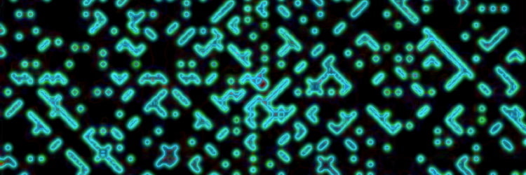

# Hello! I'm Sophie. I'm a software engineer. 

With a background in academic research (philosophy and cognitive science), I'm a lifelong learner. I bring the experience of systematic thinking across a variety of problem domains, and the ability to communicate complex concepts to my web development work. 

## Main languages / frameworks:
### JavaScript | PHP | React/Redux | Laravel | HTML5 | CSS 

See my [portfolio site](https://ammersive.github.io/portfolio/) for more.  

    
