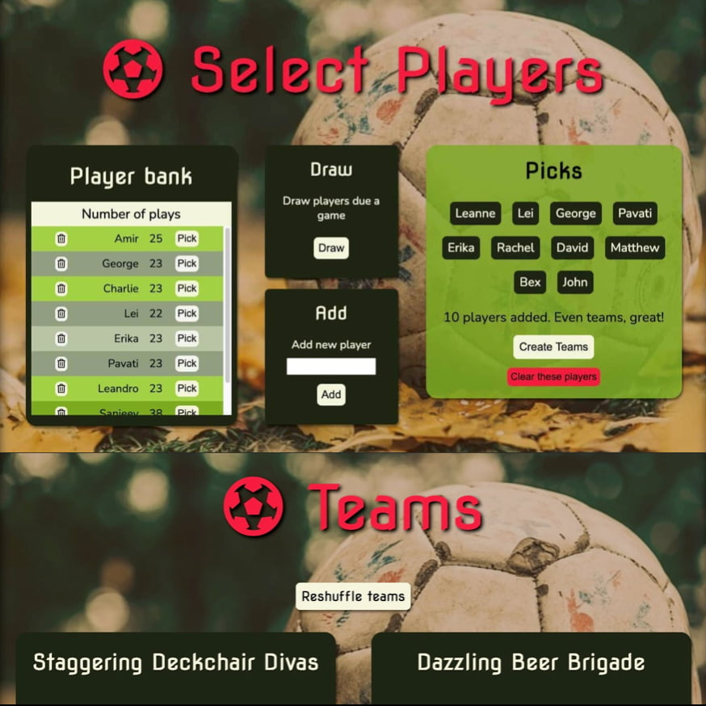
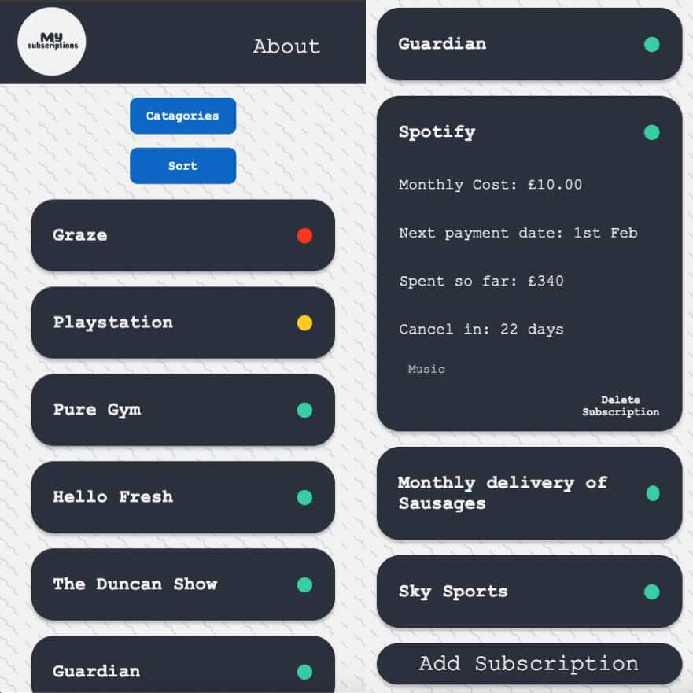
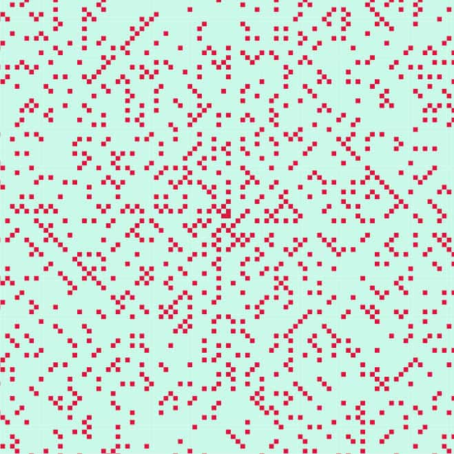

# Hello! I'm Sophie, I'm a web developer. 

    

I love solving problems and building solutions with tidy, scalable, maintainable code. 

With a background in academic research (philosophy and cognitive science), I'm a lifelong learner. I bring the experience of systematic thinking across a variety of problem domains, and the ability to communicate complex concepts to my web development work. 

I'm interested in building applications that make abstract information easier to understand and navigate, and which facilitate effective decision making.

## Main languages / frameworks:
### JavaScript | PHP | React/Redux | Laravel | HTML5 | CSS 

See my [portfolio site](https://ammersive.github.io/portfolio/) for more.  
I'm currently available for work/collaboration: send me an [email](mailto:sophie.stammers@gmail.com).
